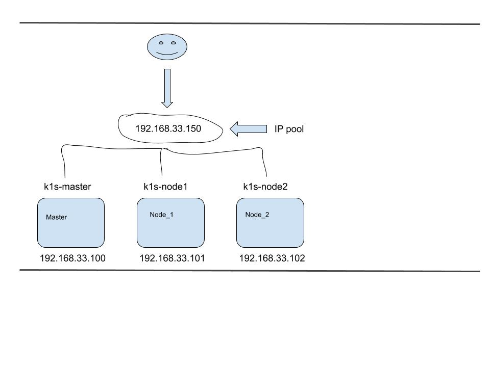

#### metallb

##### Для начала необходимо запустить кластер k8s.
Можно [воспользоваться](https://github.com/LinarNadyrov/small_k8s)

##### Установка MetalLB
```
kubectl apply -f https://raw.githubusercontent.com/metallb/metallb/v0.9.3/manifests/namespace.yaml
kubectl apply -f https://raw.githubusercontent.com/metallb/metallb/v0.9.3/manifests/metallb.yaml
# On first install only
kubectl create secret generic -n metallb-system memberlist --from-literal=secretkey="$(openssl rand -base64 128)"
```
Официальная [документация](https://metallb.universe.tf/installation/). 

##### Установка ConfigMap
```
kubectl apply -f configmap.yaml
```
##### Установка ingress-nginx
```
kubectl apply -f deploy.yaml
```
Оригинальный [deploy](https://raw.githubusercontent.com/kubernetes/ingress-nginx/master/deploy/static/provider/baremetal/deploy.yaml)

##### Установка приложения, сервиса и ингресса
```
kubectl apply -f hello_manifest/simple-service.yaml
kubectl apply -f hello_manifest/simple-ingress.yaml

or (лучше устанавливать с помощью helm)
helm upgrade --install hello hello --namespace default
```
##### Преимущества helm
```
helm list -a -A
helm delete hello -n default
```

##### Проверка 
```
curl http://192.168.33.150/hello

Результат           
Hello World
```

##### Общая схема полученного результата


